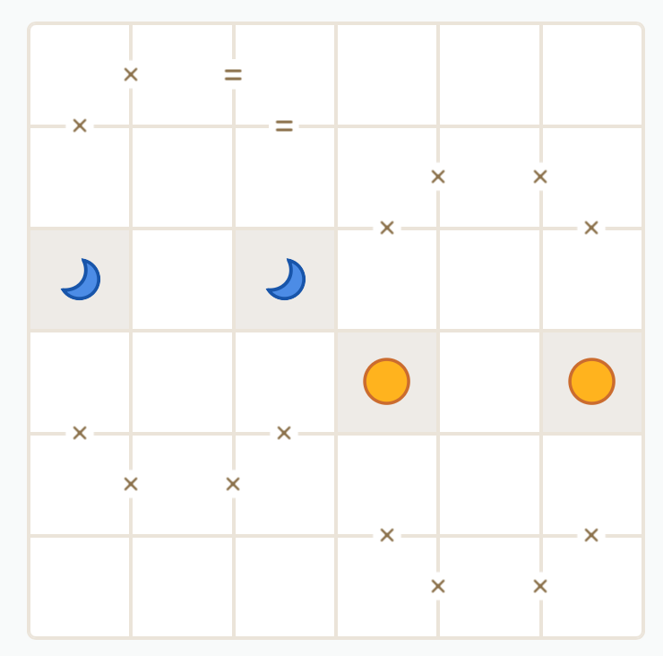

# Tango
Solver for linkedin's tango puzzle (https://www.linkedin.com/games/tango/)

**Rules**

- Fill the grid so that each cell contains either a sun or a moon.
- No more than 2 suns or moons may be next to each other, either vertically or horizontally.
- Each row (and column) must contain the same number of suns and moons.
- Cells separated by an = sign must be of the same type.
- Cells separated by an x sign must be of the opposite type.

## Usage
Write linkedin's puzzle in a text file.

This board:




Becomes this input:

<pre>
+-+-+-+-+-+-+
| x = | | | |
+x+-+=+-+-+-+
| | | | x x |
+-+-+-+x+-+x+
|M| |M| | | |
+-+-+-+-+-+-+
| | | |S| |S|
+x+-+x+-+-+-+
| x x | | | |
+-+-+-+x+-+x+
| | | | x x |
+-+-+-+-+-+-+
</pre>

Here's an <a href='samples/empty_board.txt'>empty board</a> and a <a href='samples/sample_input.txt'>sample input</a>. You can also get an input file for today's puzzle using <a href='scrape-tango.js'>scrape-tango.js</a>.

Run as:
```bash
tango.py [input file]
```

Example:
```bash
tango.py samples\sample_input.txt
```


## TO DO
- The solver currently does a recursive brute-force search, and it's pretty quick. Changing to a logic based search (e.g. "MM(space)" → "MMS", "M(space)M" → "MSM", etc.) could be fun, but also a lot of work. 


## Authors

[Eduardo Tubert](https://www.linkedin.com/in/eduardo-t-6766a42b0)

## License

[MIT](LICENSE)